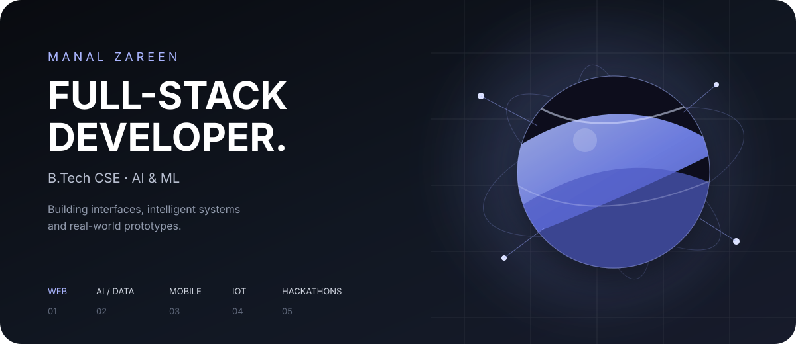

<div align="center">



<br/>


<br/><br/>

<a href="YOUR_LINKEDIN"></a>
<a href="YOUR_PORTFOLIO"></a>
<a href="mailto:YOUR_EMAIL"></a>

</div>

---

<div align="center">

## ✦ ABOUT ME

</div>

<table>
<tr>
<td width="58%" valign="top">

### Hi, I'm Manal.

I'm a **Full-Stack Developer** and **B.Tech CSE (AI & ML)** student who enjoys turning ideas into things people can actually interact with.

My work sits across **web development, mobile apps, AI/data, IoT concepts and real-world prototypes**.

I've built projects for hackathons, experimented with intelligent systems, worked with Arduino simulations, explored data with Python, and designed interfaces where the experience matters just as much as the functionality.

> **I don't just want to make software work.  
> I want to make it useful, understandable and memorable.**

</td>
<td width="42%" valign="top">

```text
┌─────────────────────────────┐
│       CURRENT FOCUS         │
├─────────────────────────────┤
│                             │
│  ◈ Full-Stack Development   │
│  ◈ AI / ML                  │
│  ◈ Data & Simulation        │
│  ◈ Real-World Systems       │
│  ◈ Creative Interfaces      │
│                             │
│  NEXT                       │
│  C++ · DSA · PyTorch        │
│  Computer Vision · ROS2     │
│  Robotics                   │
│                             │
└─────────────────────────────┘
```

</td>
</tr>
</table>

---

<div align="center">

## ⚡ THE TOOLKIT

<sub>Technologies I actively use or have worked with</sub>

<br/><br/>


<br/><br/>


</div>

<br/>

<table>
<tr>
<td width="25%" align="center">

### WEB

`JavaScript`  
`React`  
`HTML`  
`CSS`

</td>
<td width="25%" align="center">

### MOBILE

`React Native`  
`Mobile UI`  
`Cross-platform`

</td>
<td width="25%" align="center">

### AI / DATA

`Python`  
`NumPy`  
`Pandas`  
`ML foundations`

</td>
<td width="25%" align="center">

### HARDWARE

`Arduino`  
`IoT concepts`  
`Simulation`

</td>
</tr>
</table>

---

<div align="center">

## 🚀 SELECTED WORK

<sub>From prototypes to systems designed around real problems.</sub>

</div>

### 🚑 Emergency Corridor System

> **Real-time emergency vehicle coordination**

A 36-hour hackathon prototype designed to help vehicles become aware of an approaching ambulance and react faster.

**Built with:** `JavaScript` `Node.js` `Socket.IO` `GPS` `Geolocation API`

- Live ambulance location
- Vehicle-side proximity alerts
- Real-time communication
- Emergency corridor visualization
- Designed around reducing delays in emergency travel

---

### 🌊 Aquaculture Intelligence

> **IoT + simulation + predictive monitoring**

A smart aquaculture monitoring concept that models water-quality conditions and connects them to fish-health risks.

**Parameters:** `Temperature` `pH` `Dissolved Oxygen` `Turbidity` `Ammonia`

**Exploring:** `Digital Twin` `Anomaly Detection` `Predictive Analytics` `Closed-loop Actuation`

---

### 🛡️ SafeSight

> **AI-assisted safety intelligence**

A safety-focused system exploring how technology can turn observations into actionable corrective information instead of simply producing alerts.

**Focus:** `AI` `Automation` `Safety Systems` `Human-centered Design`

---

### ♿ AccessAI

> **Technology designed around accessibility**

An accessibility-focused AI concept using voice-driven interaction to make digital environments easier to navigate.

**Focus:** `AI` `Voice Interaction` `Accessibility`

---

### ✦ Manal Studio

> **A digital identity built through code**

A creative portfolio experience focused on visual storytelling, interactive frontend development and a distinctive digital identity.

**Built with:** `Next.js` `React` `TypeScript` `Tailwind CSS`

---

### 🏫 Campus Explorer

> **A polished campus discovery interface**

A frontend project with search, filtering and event-oriented interactions, designed to feel more like a modern product than a conventional dashboard.

**Built with:** `HTML` `CSS` `JavaScript`

---

<div align="center">

## ◌ HOW I BUILD

</div>

```text
              ┌───────────────┐
              │     IDEA      │
              └───────┬───────┘
                      ↓
              ┌───────────────┐
              │   EXPLORE     │
              │  the problem  │
              └───────┬───────┘
                      ↓
              ┌───────────────┐
              │    DESIGN     │
              │  the system   │
              └───────┬───────┘
                      ↓
              ┌───────────────┐
              │     BUILD     │
              │    the MVP    │
              └───────┬───────┘
                      ↓
              ┌───────────────┐
              │    TEST       │
              │  break / fix  │
              └───────┬───────┘
                      ↓
              ┌───────────────┐
              │    SHIP       │
              └───────────────┘
```

---

<div align="center">

## 🏁 HACKATHON MODE

</div>

<table>
<tr>
<td align="center" width="33%">

### 36H
**Emergency Systems**

Real-time emergency corridor prototype

</td>
<td align="center" width="33%">

### 24H
**Aquaculture Intelligence**

IoT + simulation + intelligent monitoring

</td>
<td align="center" width="33%">

### ⚡
**NEURAX 2.0**

AI-powered safety concept

</td>
</tr>
</table>

<br/>

<div align="center">

> **Ideas are easy to describe.  
> Building something people can actually see is the fun part.**

</div>

---

<div align="center">

## 🧭 WHERE I'M HEADING

</div>

<table align="center">
<tr>
<td align="center">

**NOW**

Full-Stack  
AI / ML  
Python  
React  
Data

</td>
<td align="center">

→

</td>
<td align="center">

**NEXT**

C++  
DSA  
PyTorch  
Computer Vision

</td>
<td align="center">

→

</td>
<td align="center">

**FUTURE**

ROS2  
Robotics  
Intelligent Systems  
AI × Hardware

</td>
</tr>
</table>

---

<div align="center">

## 📊 GITHUB, BUT HONEST

<br/>


<br/><br/>


<br/><br/>

<sub>
GitHub's language card reflects code detected across my repositories.
The toolkit above represents the technologies I actually work with.
</sub>

</div>

---

<div align="center">

## ✦ CURRENTLY EXPLORING


<br/><br/>

`C++` · `DSA` · `PyTorch` · `Computer Vision` · `ROS2` · `Robotics`

<br/>

<sub>Expanding from software into intelligent, physical systems.</sub>

</div>

---

<div align="center">

## ◈ A LITTLE MORE HUMAN

I like **building things from scratch**, experimenting with ideas,  
working under hackathon pressure, and turning rough concepts into something demoable.

I'm especially interested in the space where **software meets the real world**.

<br/>

### Code → Build → Break → Learn → Repeat

</div>

---

<div align="center">

## LET'S BUILD SOMETHING INTERESTING.

<br/>

<a href="YOUR_LINKEDIN"></a>
<a href="YOUR_PORTFOLIO"></a>
<a href="mailto:YOUR_EMAIL"></a>

<br/><br/>


</div>
